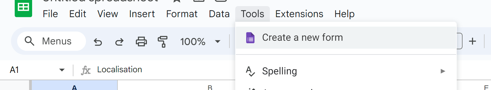
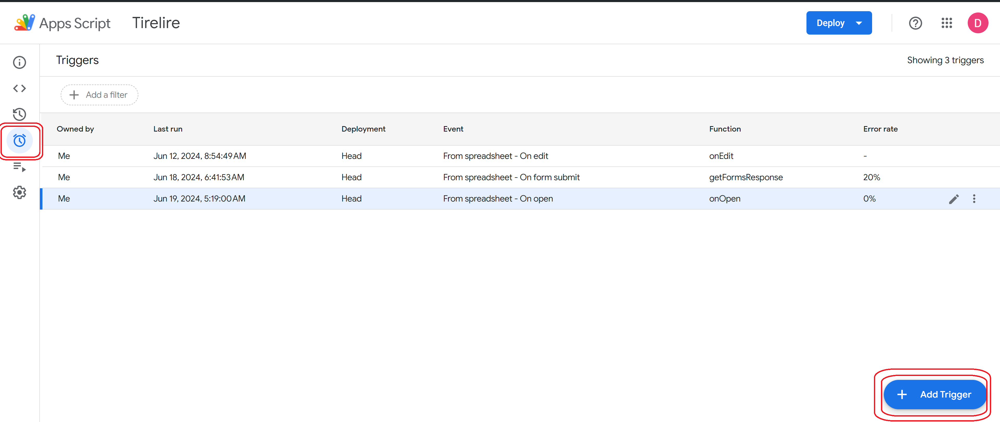
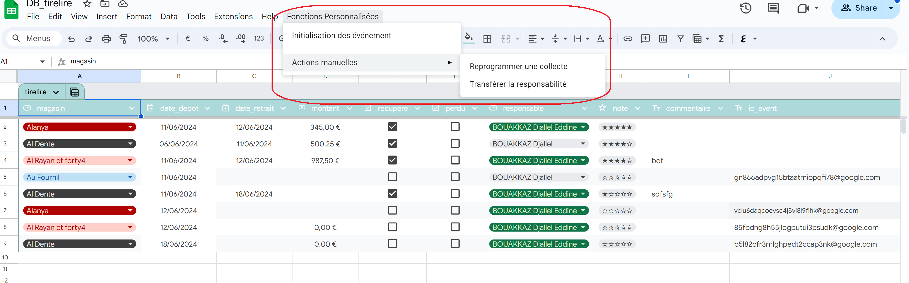
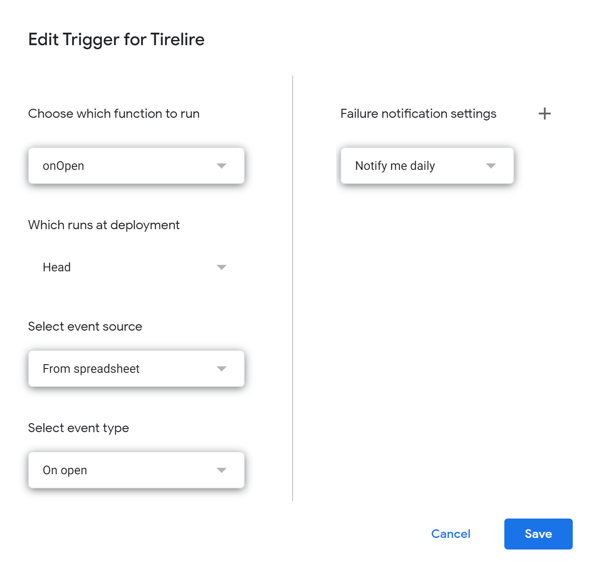
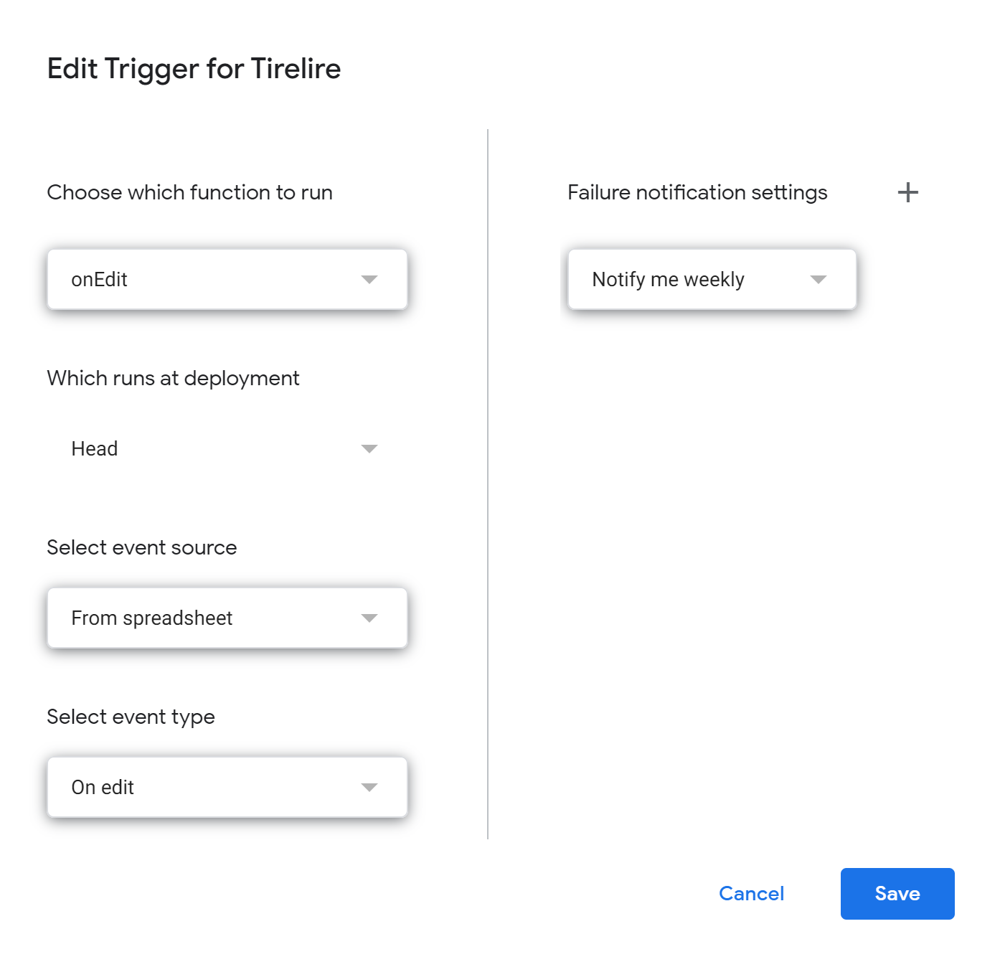
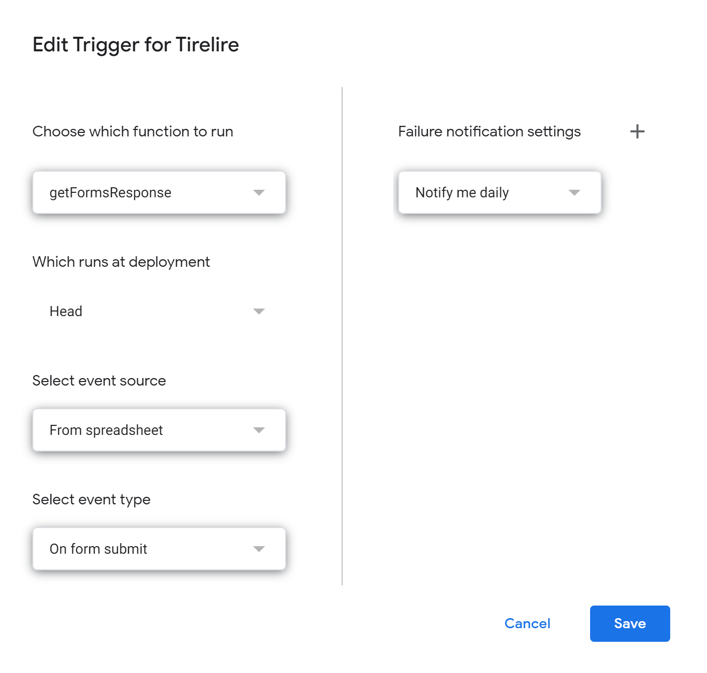
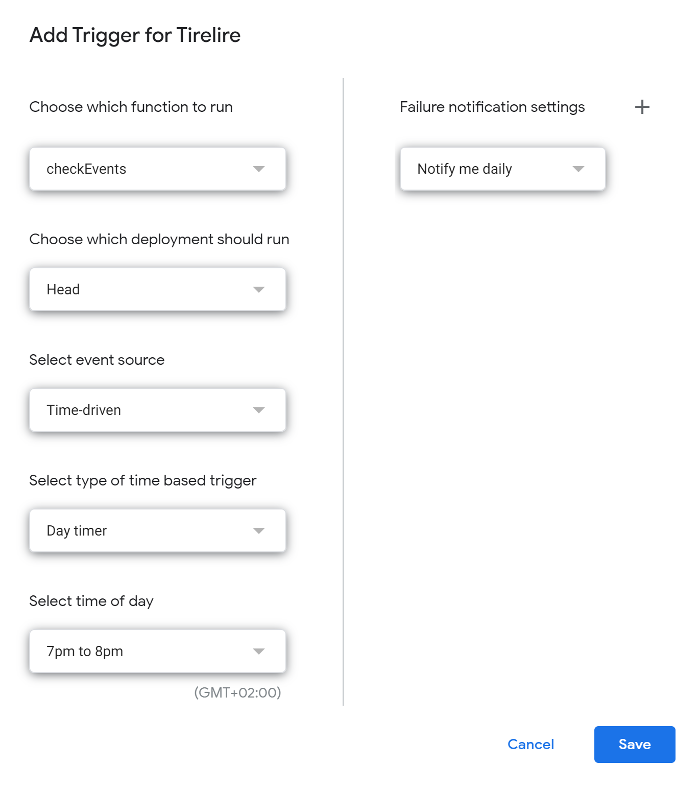

# SUIVIE DES TIRELIRES

## Présentation

Ce projet a pour but d'automatiser la saisie des information des différentes tirelires.

## Creation du projet

### Feuille de calcul

Avant toute chose il est nécessaire de créer un **Google Sheet** sur votre **Google Drive**. Il servira de base de donnes pour les différentes information et interaction avec les tirelires. Ce dernier doit impérativement comporter les pages suivantes :

* **frere** : Informations des responsables des tirelires
* **magasin** : Adresses et contacts des magasins
* **tirelire** : État des tirelires
* **p_key** : (Page cachée) clés primaires des différentes pages
* **Aux** : (Page cachée) différentes categories utilisées dans les autres pages
* **quartier** : (Page cachée) liste dynamique des différents quartiers par ville sélectionnée

### Questionnaire

Une fois le **Google Sheet** crée il faut lui associer un **Google Form**. Pour ce faire


Le **Google Form** doit contenir une suite logique de questions pour déduire l'état de la tirelire le jour de la récupération de cette dernière.

## Installation en local

```shell
git clone https://github.com/Djallel93/amana_tirelire.git
```

Pour établir le lien avec Google App Script il faut avoir préalablement installé **clasp**

```shell
sudo apt update
sudo apt upgrade
sudo apt install npm
sudo npm install -g @google/clasp
# Google App Script Snippet
npm i -D @types/google-apps-script
```

Il faut ensuite activer le [Google Apps Script API](https://script.google.com/home/usersettings)


Enfin, il faut s'authentifier avec votre compte Google et cloner le projet (vous aurez besoin du script_id)


```shell
clasp login
clasp clone \<script_ID_Google_Sheet\> --rootDir ./Google_Sheets
cd ./Google_Sheets
clasp push --watch -P . 
```

## Programmation des déclencheurs

Pour créer un déclencheur il faut aller dans **Triggers** dans le volet de gauche puis **Add Trigger**



### OnOpen

Le script [OnOpen](Google_Sheets/scripts/onOpen.js) doit se déclencher à l'ouverture du **Google Sheet** pour créer le menue contextuelle permettant les différentes actions sur les tirelires.





### OnEdit

Le script [OnEdit](Google_Sheets/scripts/onEdit.js) permet de gérer les différentes action post édition des différentes pages du Google Sheet



### getFormsResponse

Le script [getFormsResponse](Google_Sheets/scripts/getFormsResponse.js) recupere la réponse du formulaire lorsqu'elle est soumise puis alimente le Google Sheet en conséquent



## checkEvent

Le script [checkEvent](Google_Sheets/scripts/checkEvents.js) se déclenche tous les jours a 19 H pour vérifier si des tirelires ont potentiellement pu être récupérées par un frère. Il envoie un mail avec un formulaire pour mettre  à jour les information de la tirelire concernée.



## Utilisation du rapport

1. Installer **Power BI Desktop** depuis le [Microsoft Store](ms-windows-store://?referrer=storeforweb)

2. Ouvrir le fichier Track_tirelire.pbip dans le répertoire **/Power_BI**
3. Rafraîchir le rapport en cliquant sur **Actualiser**

4. Si la carte ne s'affiche pas correctement vérifier que le rapport a biens les autorisations nécessaires. pour ce faire :
   * Aller dans File > Option and settings > Options
   * Vérifier que la case est bien cochée
  

## Liens utiles

### Google Sheets

* [Développement](https://docs.google.com/spreadsheets/d/12vU-UwntsirFpH03dfijqU7SZ2VSaWiqXRCzGl0Fc5E/edit?usp=sharing)

* [Production](https://docs.google.com/spreadsheets/d/12vU-UwntsirFpH03dfijqU7SZ2VSaWiqXRCzGl0Fc5E/edit?usp=sharing)

### Google Forms

* [Développement](https://docs.google.com/forms/d/1TBJ-yJ_PW_Qvv9tB4NYXT0eUVHuuLIeMu0ja3GAR2hc/edit)

* [Production](https://docs.google.com/forms/d/1TBJ-yJ_PW_Qvv9tB4NYXT0eUVHuuLIeMu0ja3GAR2hc/edit)

### Google App Script

* [Développement](https://script.google.com/u/0/home/projects/1nWWb_OKXsshbDaJ3jsTAoDOj3y7BU_I4QB2XIKu82RzwVxg4AXOCPFQ1)

* [Production](https://script.google.com/u/0/home/projects/1nWWb_OKXsshbDaJ3jsTAoDOj3y7BU_I4QB2XIKu82RzwVxg4AXOCPFQ1)
