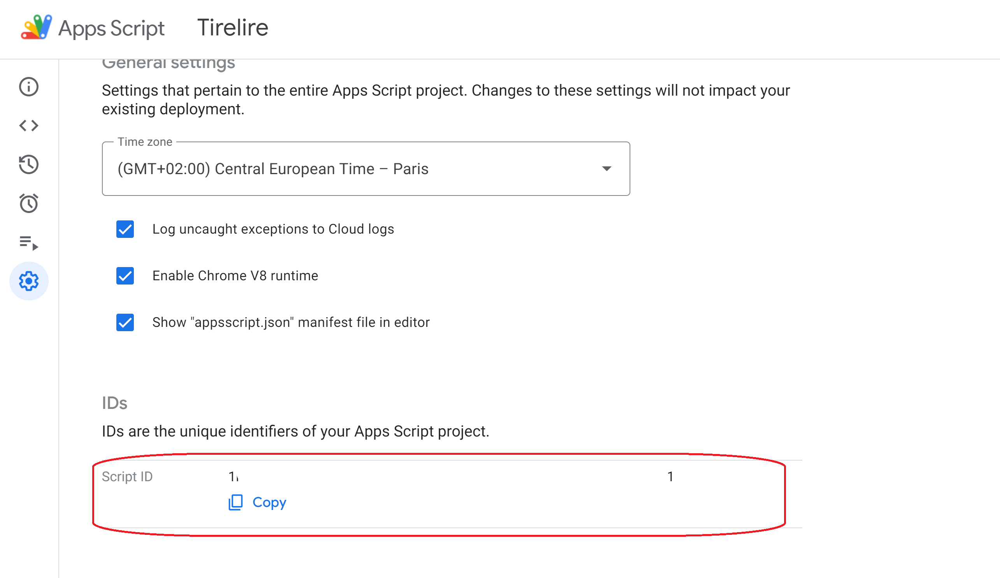
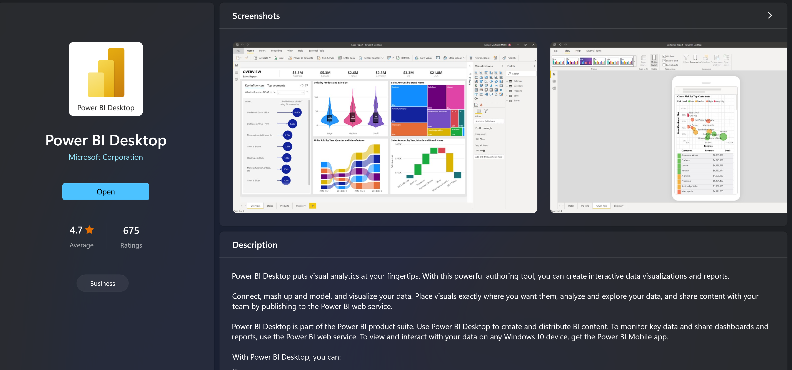
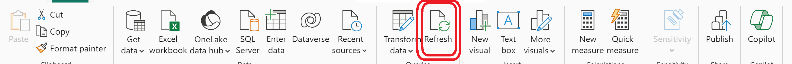
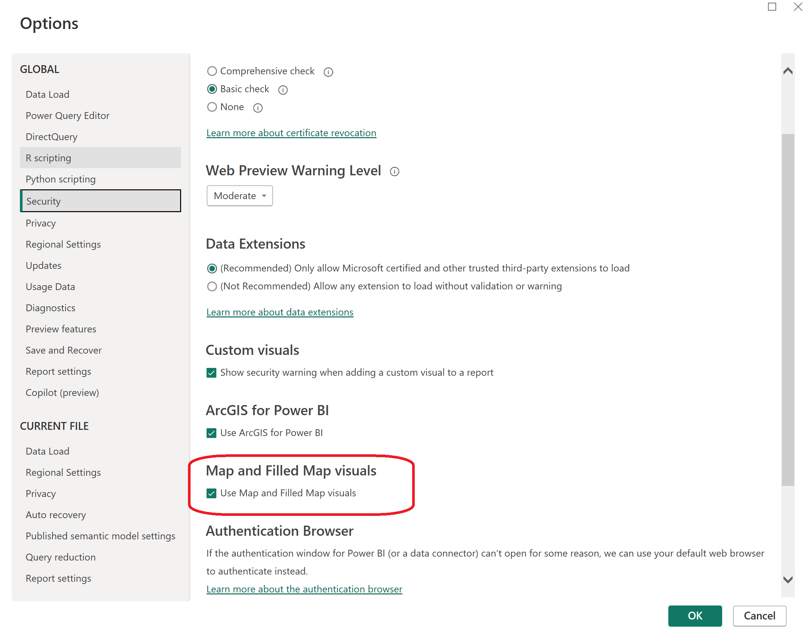

# SUIVIE DES TIRELIRES

## présentation

Ce projet a pour but d'automatiser la saisie des information des différentes tirelires.

## Installation en local

```shell
git clone https://github.com/Djallel93/amana_tirelire.git
```

Pour établir le lien avec Google App Script il faut avoir préalablement installé **clasp**

```shell
sudo apt update
sudo apt upgrade
sudo apt install npm
sudo npm install -g @google/clasp
# Google App Script Snippet
npm i -D @types/google-apps-script
```

Il faut ensuite activer le [Google Apps Script API](https://script.google.com/home/usersettings)


Enfin, il faut s'authentifier avec votre compte Google et cloner le projet (vous aurez besoin du script_id)

Dans le cas de ce repository deux projets Google Apps Script sont utilisés: un projet pour le Google Sheets et un pour le Google Forms. Vous devez cloner chaque projet dans son bon répertoire.

```shell
clasp login
clasp clone \<script_ID_Google_Sheet\> --rootDir ./Google_Sheets
clasp clone \<script_ID_Google_Forms\> --rootDir ./Google_Forms
```

## Utilisation du rapport

1. Installer **Power BI Desktop** depuis le [Microsoft Store](ms-windows-store://?referrer=storeforweb)

2. Ouvrir le fichier Track_tirelire.pbip dans le répertoire **/Power_BI**
3. Rafraîchir le rapport en cliquant sur **Actualiser**

4. Si la carte ne s'affiche pas correctement vérifier que le rapport a biens les autorisations nécessaires. pour ce faire :
   * Aller dans File > Option and settings > Options
   * Vérifier que la case est bien cochée
  

## Liens utiles

### Google Sheets

* [Développement](https://docs.google.com/spreadsheets/d/12vU-UwntsirFpH03dfijqU7SZ2VSaWiqXRCzGl0Fc5E/edit?usp=sharing)

* [Production]()

### Google Forms

* [Développement](https://docs.google.com/forms/d/1TBJ-yJ_PW_Qvv9tB4NYXT0eUVHuuLIeMu0ja3GAR2hc/edit)

* [Production]()

### Google App Script

* [Développement](https://script.google.com/u/0/home/projects/1nWWb_OKXsshbDaJ3jsTAoDOj3y7BU_I4QB2XIKu82RzwVxg4AXOCPFQ1)

* [Production]()